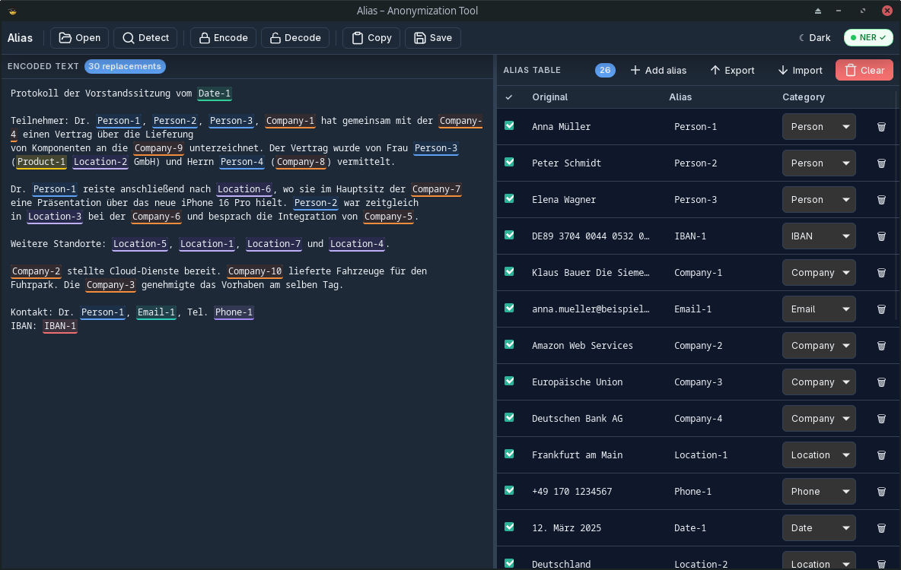
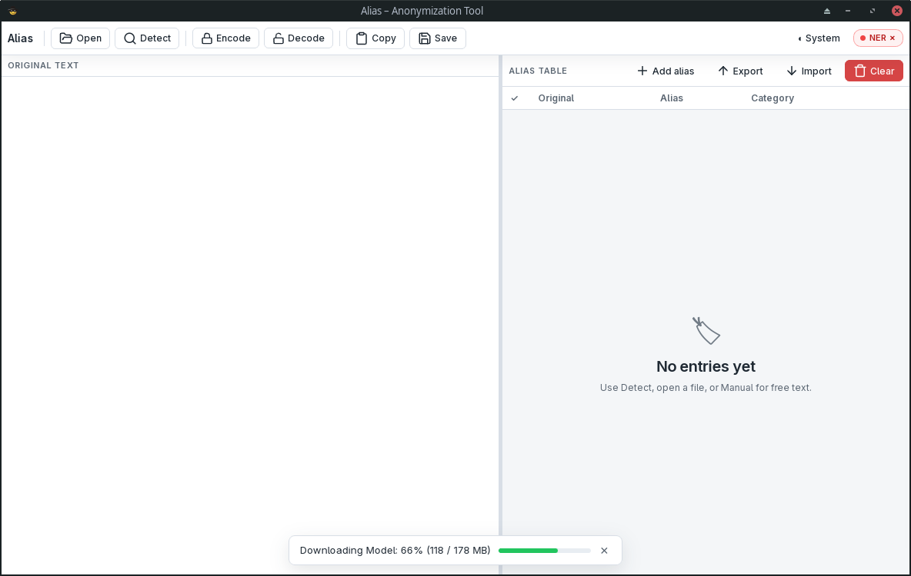
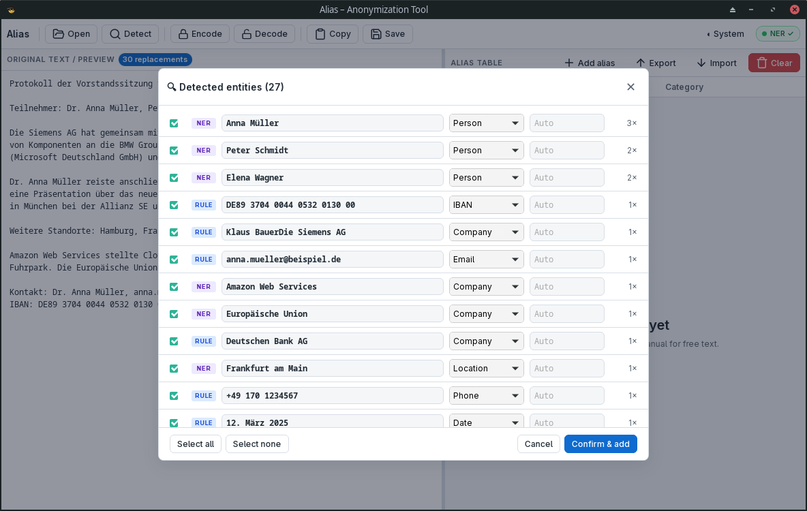

# Alias

**Alias** is a **Tauri** desktop app for **pseudonymizing** text and spreadsheets: entity detection (including persons via local ONNX NER), **original → alias** mapping, **encode / decode** with a persistent alias table, file import (e.g. Excel), and light/dark themes.

[](./LICENSE)
[](https://github.com/fly2nbc-oss/alias/actions/workflows/ci.yml)
[](https://github.com/fly2nbc-oss/alias/releases)
[]()
[](https://tauri.app/)

## Contents

[Screenshots](#screenshots) · [Features](#features) · [Install](#install) · [Usage](#usage) · [Platforms & files](#platforms--file-formats) · [Development](#development) · [Contributing](#contributing) · [License](#license)

## Screenshots

Images live in [`screenshots/`](./screenshots/). Included in this repo:

| File | Description |
|------|-------------|
| `alias_linux-dark.png` | Main window, Linux, dark mode |
| `alias_linux-light.png` | Main window, Linux, light mode |
| `alias_linux-light-detect.png` | Detect / candidates, Linux, light mode |

Optional extras: `windows-main.png`, `macos-main.png`, `mapping-panel.png`, etc.






## Features

- **Local NER** (ONNX): model downloads on first run when needed.
- **Split UI**: text panel and **alias table** (original, alias, category, confirmed) with a **resizable** divider.
- **Encode / decode** with **substitution preview** and highlighting.
- **Persistent store** (loaded on startup), JSON **import/export**, optional autosave path.
- **Files**: open dialog and **drag & drop**; text and **spreadsheets** via the Rust parser (e.g. **Excel** through `calamine`).
- **Themes**: light / dark; choice is remembered (`system` / `light` / `dark`).
- **Stack**: Tauri 2, Vite, TypeScript frontend; Rust backend with optional **`onnx-ner`** feature.

## Install

### From GitHub Releases

1. Open [Releases](https://github.com/fly2nbc-oss/alias/releases) (`v*` tags).
2. Download the asset for your OS (`.exe` / NSIS, `.msi`, `.dmg`, `.AppImage`, `.deb` when published).
3. Verify checksums with `SHA256SUMS.txt` when provided.

### From source

See [Development](#development).

## Usage

1. Start the app; allow **NER model download** if prompted (progress is shown in the UI).
2. Paste text or **open** / **drop** a file.
3. Run **Detect**, review candidates, accept into the mapping table or **add aliases manually**.
4. **Encode** applies stored aliases to text; **Decode** reverses using the mapping store.
5. **Export/import** the store or save results via the file dialogs.

Toolbar: file actions, encode/decode-related controls, theme, **NER** status, **About**.

## Platforms & file formats

| | |
|--|--|
| **Desktop** | Windows, Linux, macOS (depends on Tauri / WebView) |
| **Bundles** | See [`src-tauri/tauri.conf.json`](src-tauri/tauri.conf.json): e.g. `deb`, `appimage`, `nsis`, `dmg` |
| **Formats** | Text and spreadsheet formats supported by the parser (notably **Excel** via `calamine`) |

## Development

**Requirements:** Node.js, Rust (stable), and [Tauri v2 prerequisites](https://v2.tauri.app/start/prerequisites/) for your OS (e.g. WebKitGTK on Linux, WebView2 on Windows).

```bash
git clone https://github.com/fly2nbc-oss/alias.git
cd alias
npm install
npm run dev              # Vite; use `npm run tauri dev` for the full Tauri shell
```

Frontend only:

```bash
npm run build            # tsc && vite build
```

Release binary (no automatic version bump):

```bash
npm run build
npm exec tauri build
```

With automatic patch bump (see `package.json` / `scripts/bump-patch.mjs`):

```bash
npm run tauri:build
```

**Linux AppImage:** Tauri expects [`linuxdeploy`](https://github.com/linuxdeploy/linuxdeploy) on `PATH`. If it is missing, the AppImage step fails but the **`.deb`** bundle can still succeed.

**Smaller binary without bundled ML:** build with `--no-default-features` to disable `onnx-ner` (documented in [`src-tauri/Cargo.toml`](src-tauri/Cargo.toml)).

## Contributing

See [CONTRIBUTING.md](./CONTRIBUTING.md) and [CODE_OF_CONDUCT.md](./CODE_OF_CONDUCT.md). Changelog: [CHANGELOG.md](./CHANGELOG.md).

## License

[Apache-2.0](./LICENSE).
